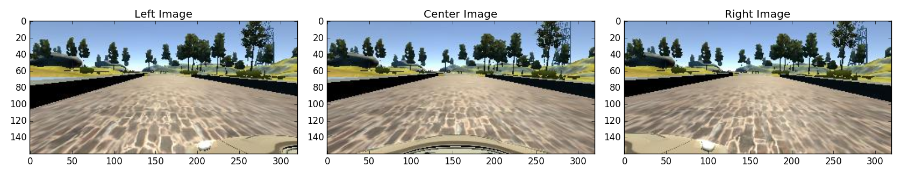
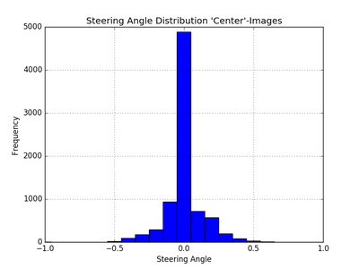
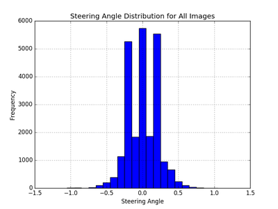
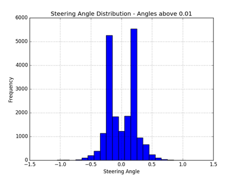
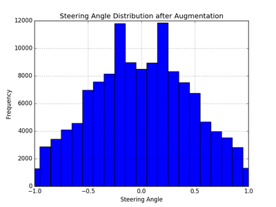
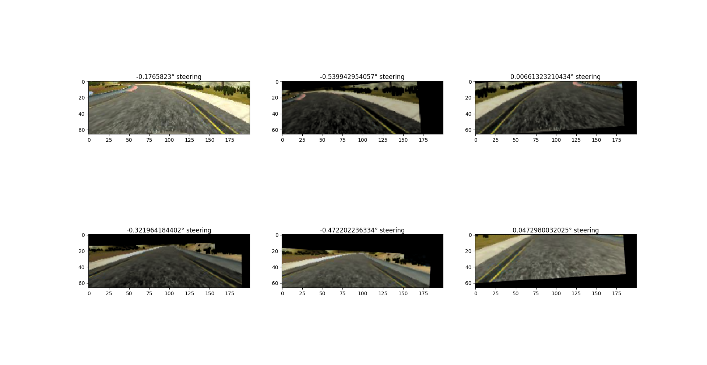

# Project 3: Behavioral Cloning

## Used Data and Simulator Settings

For training and validation purposes, the provided *udacity dataset* was used.
While testing the models on track, the graphics quality 'fastest' is used with a maximum throttle of 0.25.

Improving the graphics quality will not affect performance on the first track, but the model will fail on track 2 due to 
dominant shadows on track.

## Provided Data

The provided dataset contains three images from different angles (left, center, right) for every timestamp. Additionally, 
the according steering angle, throttle, brake and speed values were provided in a textfile.

The steering angle distribution of the center images contains a lot of small values, including a large amount of 
0°-values. 

 

## Data Augmentation

For training, all provided images are used. The steering angles for the left and right images are adjusted by a fixed 
value of 0.2 = 5° for left and -0.2 for right images. This step is used instead of recording additional recovery data, 
to get the car to drive in the middle of the road. 
All images with an according steering angle below a threshold (here 0.1) are discarded due to the overrepresentation in 
the dataset.

  

To further increase the number of unique training images and to minimze a bias towards one side, all images are flipped 
horizontally and their steering angles 
multiplied by a factor of -1. Additionally, all images are cropped at the bottom and the top, so unnecessary parts of 
the image are not passed to the model (i.e. sky, trees etc). 
This resulting dataset is further augmented with additional images by using random 
rotation, shifts and brightness alteration (uniform distribution of random variables). 
The steering angle is only affected by shifting the image horizontally, 
where a shift by 1 px results in an increase of 0.015. These augmentation steps will make the model invariant to a 
certain amount of brightness change (e.g. shadows), y-shifts (slopes), rotation (banked curves, roll angle) and will 
increase the standard deviation of the steering angles. Using the resulting dataset, the model will be confident driving 
corners with a wide variety of steering angles and will not be biased by the overrepresented low steering angles in the 
initial dataset. 

For using data augentation on the fly, a custom generator was designed to load, crop, flip and augment a batch of images and feed 
it to the model for training.  

## Training Data
The following images are examples of the used training data.

## Model Architecture
After training and successfully testing different model architectures, like feature extraction of vgg16 and an own model, 
the best model turned out to be the one proposed in 
[Bojarski 2016: End to End Learning for Self-Driving Cars](http://images.nvidia.com/content/tegra/automotive/images/2016/solutions/pdf/end-to-end-dl-using-px.pdf).
It uses a low number of parameters, around 250k, and thus trains quite fast in comparison. The results of all models 
were comparable, but the other models took significantly longer to train.

The architecture looks like this:

Layer (type)   |                  Output Shape      |    Param #   |  Connected to  
----------------|-----------------------------------|---------------|-----------------------|                   
lambda_1 (Lambda)          |      (None, 66, 200, 3)  |  0     |      lambda_input_1[0][0]             
convolution2d_1 (Convolution2D)|  (None, 31, 98, 24)|    1824 |       lambda_1[0][0]                   
convolution2d_2 (Convolution2D)|  (None, 14, 47, 36)|    21636 |      convolution2d_1[0][0]            
convolution2d_3 (Convolution2D)|  (None, 5, 22, 48)|     43248|       convolution2d_2[0][0]            
convolution2d_4 (Convolution2D)|  (None, 3, 20, 64)|     27712 |      convolution2d_3[0][0]            
convolution2d_5 (Convolution2D)|  (None, 1, 18, 64)|     36928 |      convolution2d_4[0][0]            
flatten_1 (Flatten) |             (None, 1152)|          0  |         convolution2d_5[0][0]            
dense_1 (Dense) |                 (None, 100)|           115300 |     flatten_1[0][0]                  
dropout_1 (Dropout) |             (None, 100)|           0   |        dense_1[0][0]                    
dense_2 (Dense)|                  (None, 50)|            5050 |       dropout_1[0][0]                  
dropout_2 (Dropout) |             (None, 50)|            0  |         dense_2[0][0]                    
dense_3 (Dense)|                  (None, 10)|            510 |        dropout_2[0][0]                  
dense_4 (Dense) |                 (None, 1)|             11  |        dense_3[0][0]                    
Total params: 252219

It consists of a normalization layer (Lambda), followed by 5 convolutional layers, that use a 5x5 kernel with a (2,2) stride in 
the first three layers and a 3x3 kernel in the 4th and 5th layer. Three fully connected layers follow, that lead to a 
single output representing the steering angle. The input is a (200,66,3) image.
To address overfitting, dropout with a 50% keep rate was used for the first 2 fully connected layers. Additionally, 
L2-regularization was tested but did't improve the models performance.

The authors of this model designed it for the exact same task, except the data were real world images instead of 
simulator data. This 
explains the good performance in spite of the low number of parameters, the model is well fitted to the task.

Other models with more and deeper layers performed equally but not better, so their representations may in fact be some 
sort of superset of the above mentioned model, containing some similar weights and even more additional weights close to 
zero.
 

## Model Training
The model was trained for 3 epochs with a batch size of 128. More epochs didn't improve the performance, in fact the 
behavior was often worse although the training and validation loss were lower.
The best results were achieved if every image (flipped and non-flipped), was augmented with 7 additional images of 
varied rotation, shift and brightness. The maximum values for those operations were

key | value
---|---
max. Rotation | 5°
max. Shift | 50 px
max. Brightness | 100

Dropout probability is 50%, while the weights were initialized using gaussian initialization. The initial learning rate 
was set to 10^-5. Higher learning rates were leading to the car not taking sharp turns, while lower learning rates 
demanded more epochs to train.  

## Results

Finishing both provided tracks without leaving the track.

